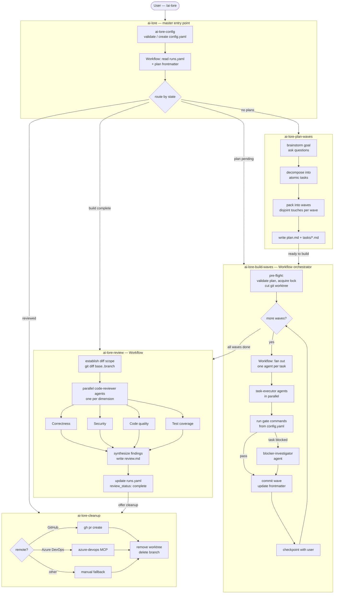

# ai-lore

A Claude Code plugin for planning, building, reviewing, and shipping work as **parallel waves of atomic tasks**. Seven skills that hand off to each other, driven by a single entry point:

| Skill | What it does |
| --- | --- |
| **`/ai-lore`** | Master entry point. Validates config, reads project state, and routes you to the right next step via a context-aware menu. Always the right first command. |
| **`/ai-lore-plan-waves`** | Brainstorms a goal into dependency-ordered *waves* of atomic tasks (tasks within a wave run in parallel because they touch disjoint files), then writes a plan folder under `.ai-lore/plans/<slug>/`. |
| **`/ai-lore-build-waves`** | Executes a plan: runs each wave as a parallel fan-out of sub-agents (one per task) via the Workflow tool, gates every task on its acceptance criteria plus the project's checks, records progress in frontmatter so runs are resumable, and checkpoints with you between waves. |
| **`/ai-lore-review`** | Reviews the code changes from a completed build: fans out four parallel agents (correctness, security, code quality, test coverage), synthesizes findings, and writes a report to the plan directory. Report-only; does not block shipping. |
| **`/ai-lore-document`** | Documents the codebase using parallel directory agents: produces per-module docs, an architecture overview, and a dependency map under `.ai-lore-docs/`. Tracks the last-documented commit and offers targeted updates on subsequent runs. |
| **`/ai-lore-cleanup`** | Closes out a finished build: opens a pull request (Azure DevOps via MCP, GitHub via `gh` CLI, or a manual fallback) or merges the branch locally, then tears down the worktree. |
| **`/ai-lore-config`** | Validates and patches `.ai-lore/config.yaml`. Auto-creates a config from detected toolchain values if missing. Run standalone or let `/ai-lore` call it automatically. |

The plugin is **codebase-agnostic**. It keys off a small `.ai-lore/config.yaml` (`gate`, `test_command`, `package_manager`, `worker`) and auto-detects sensible defaults for Node, Python, Rust, Go, Ruby, Java/Kotlin, and .NET projects when that file is missing.

## Flow



## Install

Claude Code installs plugins from a **marketplace**. This repository is itself a marketplace (it ships a `.claude-plugin/marketplace.json`), so you add the repo as a marketplace once and then install the plugin from it.

### Option A: install from GitHub (recommended)

Run these two commands inside any Claude Code session:

```
/plugin marketplace add https://github.com/dboothe/ai-lore.git
/plugin install ai-lore@ai-lore
```

- The first command registers this repo as a marketplace named `ai-lore`.
- The second installs the plugin. The syntax is `<plugin-name>@<marketplace-name>`, and here both are `ai-lore`.

> Use the full HTTPS URL as shown. The `owner/repo` shorthand (`dboothe/ai-lore`) expands to an SSH clone URL and will fail with "Permission denied (publickey)" unless you have GitHub SSH keys configured, even for this public repo.

Restart Claude Code (or start a new session) so the skills load.

### Option B: install from a local clone (for development)

```
git clone https://github.com/dboothe/ai-lore.git
```

Then point the marketplace at the local path:

```
/plugin marketplace add /absolute/path/to/ai-lore
/plugin install ai-lore@ai-lore
```

Changes you make to the local files take effect after you reload Claude Code.

### Option C: install for a whole team via settings

To make every clone of a project pick up the plugin automatically, add it to the project's `.claude/settings.json`:

```json
{
  "extraKnownMarketplaces": {
    "ai-lore": {
      "source": {
        "source": "github",
        "repo": "dboothe/ai-lore"
      }
    }
  },
  "enabledPlugins": ["ai-lore@ai-lore"]
}
```

Anyone who trusts the project's settings gets the plugin without running any commands.

### Verify the install

```
/plugin
```

This opens the plugin manager; `ai-lore` should appear as installed and enabled. You can also confirm the skills are available; they show up as `/ai-lore`, `/ai-lore-plan-waves`, `/ai-lore-build-waves`, `/ai-lore-review`, `/ai-lore-document`, `/ai-lore-cleanup`, and `/ai-lore-config`.

### Update or remove

```
/plugin marketplace update ai-lore     # pull the latest from GitHub
/plugin uninstall ai-lore@ai-lore       # remove the plugin
```

## Use

The quickest way is to let `/ai-lore` figure out what to do next:

```
/ai-lore
```

Or jump straight to a specific skill:

```
/ai-lore plan a new feature            # brainstorm and decompose
/ai-lore build                         # build the pending plan
/ai-lore review                        # review the completed build
/ai-lore cleanup                       # open a PR or merge and tear down
/ai-lore document                      # document the codebase
```

You can also invoke skills directly:

```
/ai-lore-plan-waves the unified editor
/ai-lore-build-waves
/ai-lore-review
/ai-lore-document src/api src/models
/ai-lore-cleanup
```

### Notes

- `/ai-lore` always runs `ai-lore-config` first, then reads project state via a Workflow script, and presents a context-aware menu (or routes directly when the intent is clear from arguments).
- `/ai-lore-plan-waves` always brainstorms and asks questions before writing a plan. Never plans straight from the prompt.
- `/ai-lore-build-waves` must run from the **main session** (only the main session can call the Workflow tool) and is best run from an Opus session.
- `/ai-lore-review` is report-only. It surfaces findings but does not gate cleanup; the user decides what to act on.
- `/ai-lore-cleanup` confirms before anything outward-facing or destructive (pushing, opening a PR, merging, deleting a worktree or branch).

You can also describe what you want in plain language and Claude will route to the matching skill.

## How state is stored

Plugin execution state lives under `.ai-lore/` in the target repo and is **gitignored** (per-clone):

```
.ai-lore/
├── config.yaml                   # project gate / test / worker settings
├── runs.yaml                     # registry of plan builds (the only cross-plan shared file)
├── ado.yaml                      # Azure DevOps PR settings (only if you use ADO)
├── worktrees/                    # per-plan git worktrees (default location)
│   └── <slug>/                   # one worktree per active plan build
└── plans/
    └── <YYYY-MM-DD-topic>/
        ├── plan.md               # manifest: status frontmatter + waves index
        ├── review.md             # findings report written by ai-lore-review
        └── tasks/
            └── <wave-n>-<topic>.md
```

Status lives in YAML frontmatter (written only by the orchestrator), so runs are resumable and concurrent plans stay isolated, one git worktree per plan.

Codebase documentation produced by `/ai-lore-document` is **committed** to the repo under `.ai-lore-docs/`:

```
.ai-lore-docs/
├── state.yaml                    # tracks last-documented commit per directory
├── overview.md                   # architecture overview
├── dependencies.md               # cross-module dependency map
└── modules/
    └── <dir>/
        └── <dir>.md              # per-directory module doc
```

## Configuration

`/ai-lore-config` (and by extension `/ai-lore`) writes `.ai-lore/config.yaml` on first use, auto-detecting from your repo. Edit it to match your project's real commands:

```yaml
plugin_version: 0.6.0            # managed by ai-lore-config; do not edit by hand

package_manager: pnpm            # hint only; auto-detected when omitted

gate:                            # run in order to verify a wave before marking tasks complete
  - pnpm check
  - pnpm typecheck

test_command: pnpm test          # how test-based acceptance criteria are run

worker:
  model: sonnet                  # per-task build sub-agent model
  effort: high

worktrees:
  default: true                  # build each plan in its own worktree (isolated, stable base); set false to opt out
  dir: .ai-lore/worktrees        # where per-plan worktrees are created (relative to repo root)
```

By default `/ai-lore-build-waves` runs each plan in its own git worktree cut from the committed tip of your base branch, so uncommitted work in your main checkout never leaks into a build. Set `worktrees.default: false` or ask it explicitly to build in the main checkout to opt out.

Examples for other ecosystems:

| Ecosystem | `gate` | `test_command` |
| --- | --- | --- |
| Python | `ruff check .`, `mypy .` | `pytest` |
| Rust | `cargo clippy --all-targets`, `cargo build` | `cargo test` |
| Go | `go vet ./...`, `go build ./...` | `go test ./...` |
| .NET | `dotnet build`, `dotnet format --verify-no-changes` | `dotnet test` |

## Agents

The plugin ships ten bundled sub-agents that skills fan out into. You do not invoke these directly; they are called by the orchestrator skills via the Workflow tool.

| Agent | Model | Role |
| --- | --- | --- |
| `task-executor` | sonnet / high | Executes one atomic task; returns structured result |
| `plan-reviewer` | sonnet / medium | Adversarially reviews a plan before build; catches structural issues |
| `code-reviewer` | sonnet / medium | Reviews one dimension (correctness, security, quality, or test coverage) |
| `blocker-investigator` | sonnet / medium | Investigates a blocked task and proposes a resolution |
| `directory-documenter` | sonnet / medium | Documents one directory; called by `ai-lore-document` |
| `docs-synthesizer` | sonnet / medium | Synthesizes per-directory docs into an overview and dependency map |
| `pr-body-writer` | haiku / low | Writes PR title and body from plan summary and wave history |
| `ac-verifier` | haiku / low | Independently reruns acceptance criteria claimed as passing |
| `test-check-executor` | haiku / low | Runs gate commands and tests; returns pass or full failure output |
| `toolchain-detector` | haiku / low | Detects package manager, gate, and test command from manifest files |

## Requirements

- Claude Code with plugin support (v0.6.0+).
- `/ai-lore-build-waves` uses the Workflow tool and is best run from an Opus session.
- `/ai-lore-cleanup`'s PR path uses the `gh` CLI for GitHub, the connected `azure-devops` MCP server for Azure DevOps, or a manual fallback for other hosts.

## License

MIT. See [LICENSE](LICENSE).
