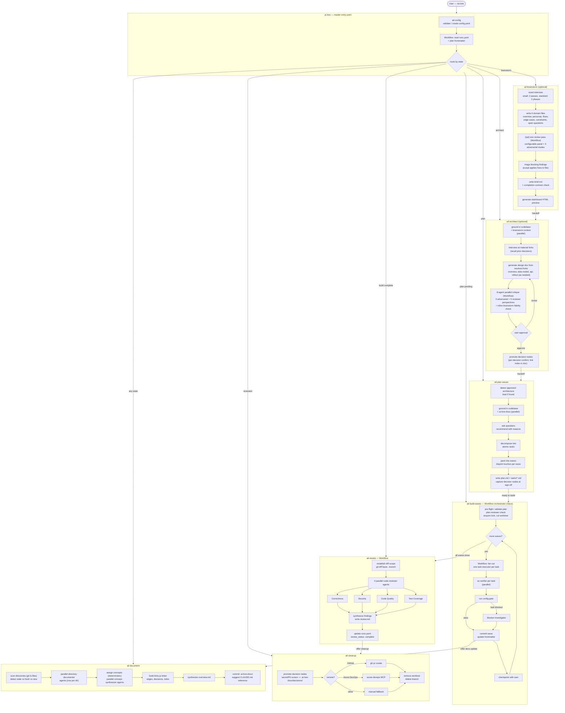

# ai-lore

A Claude Code plugin for planning, building, reviewing, and shipping work as **parallel waves of atomic tasks**. Ten skills that hand off to each other, driven by a single entry point.

> **`/ai-lore` is the only command you need to remember.** It validates your config, reads the current state of your plans and builds, and routes you to whichever step comes next: brainstorm, architect, plan, build, review, ship, or document. The other skills exist so you *can* jump straight to a step, not because you have to.

| Skill | What it does |
| --- | --- |
| **`/ai-lore`** | Master entry point. Validates config, reads project state, and routes you to the right next step via a context-aware menu. Always the right first command. |
| **`/ail-brainstorm`** | Interviews you about a feature idea (sized small or standard) and produces a focused brainstorm under `.ai-lore/brainstorm/<slug>/`: six domain files plus a one-page `brief.md` synthesis, governed by a completion contract. Optionally runs one merged review pass (a configurable expert panel plus a 3-mode adversarial critique), then triages blocking findings with you and applies accepted fixes back into the files. Generates a dashboard HTML preview. Captures the WHAT; hands off to ail-architect when you are ready. |
| **`/ail-persona`** | Creates and manages project-specific review personas for the brainstorm panel under `.ai-lore/personas/`. Interviews you about the reviewer's vantage, what they look for, and what they ignore, then offers to add them to `brainstorm.panel` in the config alongside the built-in roster. |
| **`/ail-architect`** | Designs the technical architecture for a goal before task decomposition. Grounds the HOW in your codebase and any brainstorm output, interviews you at the 2-4 material design forks (with prior committed decisions recalled into the options), then generates a design doc from the resolved forks: overview.md (goals and non-goals, decisions, components with owned paths, runtime view, risks) plus data-model.md, api.md, and rollout.md as needed. Runs an 8-agent parallel critique (3 adversarial modes + 5 reviewer perspectives) plus an inline fidelity check against the brainstorm. Requires approval before handing off to ail-plan-waves; on approval, promotes the resolved forks to per-decision MADR nodes under the plan's `decisions/` folder and leaves a link index in the doc. |
| **`/ail-plan-waves`** | Brainstorms a goal into dependency-ordered *waves* of atomic tasks (tasks within a wave run in parallel because they touch disjoint files), then writes a plan folder under `.ai-lore/plans/<slug>/`. Detects an approved architecture from ail-architect and shifts its questions from design to decomposition. At sign-off, captures consequential decomposition decisions as decision nodes. |
| **`/ail-build-waves`** | Executes a plan: runs each wave as a parallel fan-out of sub-agents (one per task) via the Workflow tool, gates every task on its acceptance criteria plus the project's checks, records progress in frontmatter so runs are resumable, and checkpoints with you between waves. |
| **`/ail-review`** | Reviews the code changes from a completed build: fans out four parallel agents (correctness, security, code quality, test coverage), synthesizes findings, and writes a report to the plan directory. Report-only; does not block shipping. |
| **`/ail-document`** | Documents the codebase as a concept-first, interlinked knowledge graph: fans out parallel directory agents for a capped per-module reference, composes dense cross-directory concept docs, and runs a deterministic linker to derive dependencies, cycles, and (once promoted by ail-cleanup) decision links under `.ai-lore-docs/`. Tracks the last-documented commit and offers targeted updates on subsequent runs. |
| **`/ail-cleanup`** | Closes out a finished build: promotes the plan's captured decision nodes into committed `.ai-lore-docs/decisions/` (after a secret/PII screen), then opens a pull request (Azure DevOps via MCP, GitHub via `gh` CLI, or a manual fallback) or merges the branch locally, and tears down the worktree. |
| **`/ail-config`** | Validates and patches `.ai-lore/config.yaml`. Auto-creates a config from detected toolchain values if missing. Run standalone or let `/ai-lore` call it automatically. |

The plugin is **codebase-agnostic**. It keys off a small `.ai-lore/config.yaml` (`gate`, `test_command`, `package_manager`) and auto-detects sensible defaults for Node, Python, Rust, Go, Ruby, Java/Kotlin, and .NET projects when that file is missing.

> This repository is a marketplace that also ships a second, independent plugin: **`statusline-metrics`**, a Claude Code status line showing context-window usage, session spend, git branch, and model/dir/lines. It is unrelated to the ai-lore pipeline; install it separately with `/plugin install statusline-metrics@ai-lore`. See [`statusline-metrics/README.md`](statusline-metrics/README.md).

## Install

Claude Code installs plugins from a **marketplace**. This repository is itself a marketplace (it ships a `.claude-plugin/marketplace.json`), so you add the repo as a marketplace once and then install the plugin from it.

### Option A: install from GitHub (recommended)

Run these two commands inside any Claude Code session:

```
/plugin marketplace add dboothe/ai-lore
/plugin install ai-lore@ai-lore
```

- The first command registers this repo as a marketplace named `ai-lore`.
- The second installs the plugin. The syntax is `<plugin-name>@<marketplace-name>`, and here both are `ai-lore`.

Restart Claude Code (or start a new session) so the skills load.

### Option B: install from a local clone (for development)

```
git clone https://github.com/dboothe/ai-lore.git
```

Then point the marketplace at the local path:

```
/plugin marketplace add /absolute/path/to/ai-lore
/plugin install ai-lore@ai-lore
```

Changes you make to the local files take effect after you reload Claude Code.

### Option C: install for a whole team via settings

To make every clone of a project pick up the plugin automatically, add it to the project's `.claude/settings.json`:

```json
{
  "extraKnownMarketplaces": {
    "ai-lore": {
      "source": {
        "source": "github",
        "repo": "dboothe/ai-lore"
      }
    }
  },
  "enabledPlugins": ["ai-lore@ai-lore"]
}
```

Anyone who trusts the project's settings gets the plugin without running any commands.

### Verify the install

```
/plugin
```

This opens the plugin manager; `ai-lore` should appear as installed and enabled. You can also confirm the skills are available; they show up as `/ai-lore`, `/ail-brainstorm`, `/ail-persona`, `/ail-architect`, `/ail-plan-waves`, `/ail-build-waves`, `/ail-review`, `/ail-document`, `/ail-cleanup`, and `/ail-config`.

### Update or remove

```
/plugin marketplace update ai-lore     # pull the latest from GitHub
/plugin uninstall ai-lore@ai-lore       # remove the plugin
```

## Use

The quickest way is to let `/ai-lore` figure out what to do next:

```
/ai-lore
```

Or jump straight to a specific skill:

```
/ai-lore brainstorm a new feature       # structured interview + diagram-rich output
/ai-lore architect a payments page      # design architecture before breaking it down
/ai-lore plan a new feature             # brainstorm and decompose
/ai-lore build                          # build the pending plan
/ai-lore review                         # review the completed build
/ai-lore cleanup                        # open a PR or merge and tear down
/ai-lore document                       # document the codebase
```

You can also invoke skills directly:

```
/ail-brainstorm a notifications system
/ail-persona create a compliance officer
/ail-architect a new payments integration
/ail-plan-waves the unified editor
/ail-build-waves
/ail-review
/ail-document src/api src/models
/ail-cleanup
```

### Notes

- `/ai-lore` always runs `ail-config` first, then reads project state via a Workflow script, and presents a context-aware menu (or routes directly when the intent is clear from arguments).
- `/ail-brainstorm` interviews you conversationally before writing anything. Never writes files straight from the prompt. Review findings are triaged with you (accepted fixes are applied to the files) rather than just reported. The HTML preview requires Node.js to generate and internet access to render (CDN-hosted mermaid and marked); it lands on a dashboard with the brief, the completion checklist, and filterable finding cards.
- `/ail-architect` grounds every architecture decision in the actual codebase before generating files. An 8-agent critique runs before you can approve. Recommended: Opus.
- `/ail-plan-waves` always brainstorms and asks questions before writing a plan. Never plans straight from the prompt. Detects approved architecture from ail-architect and narrows its questions accordingly. Recommended: Opus.
- `/ail-build-waves` must run from the **main session** (only the main session can call the Workflow tool) and is best run from an Opus session.
- `/ail-review` is report-only. It surfaces findings but does not gate cleanup; the user decides what to act on.
- `/ail-cleanup` confirms before anything outward-facing or destructive (pushing, opening a PR, merging, deleting a worktree or branch).

You can also describe what you want in plain language and Claude will route to the matching skill.

## Flow



## How state is stored

Plugin execution state lives under `.ai-lore/` in the target repo and is **gitignored** (per-clone):

```
.ai-lore/
├── config.yaml                        # project gate / test / worker settings
├── runs.yaml                          # registry of plan builds (the only cross-plan shared file)
├── ado.yaml                           # Azure DevOps PR settings (only if you use ADO)
├── brainstorm/                        # written by ail-brainstorm
│   └── <YYYY-MM-DD-topic>/
│       ├── brainstorm.yaml            # status, size, and the completion contract
│       ├── brief.md                   # one-page synthesis, written last (read this first)
│       ├── overview.md                # what/why, MVP split, success measure
│       ├── personas.md                # up to 4 personas, at least one primary
│       ├── flows.md                   # happy path and failure path(s)
│       ├── edge-cases.md              # edge case table or decision tree
│       ├── constraints.md             # access rules, business constraints, UX expectations
│       ├── open-questions.md          # blocking and deferrable questions
│       ├── review.json                # structured panel + adversarial findings with triage dispositions (if run)
│       ├── review.md                  # human-readable review report (if run)
│       └── index.html                 # self-contained HTML dashboard with mermaid diagrams
├── personas/                          # written by ail-persona
│   └── <slug>.md                      # custom review persona (vantage, looks_for, ignores)
├── worktrees/                         # per-plan git worktrees (default location)
│   └── <slug>/                        # one worktree per active plan build
└── plans/
    └── <YYYY-MM-DD-topic>/
        ├── architecture/              # written by ail-architect (optional)
        │   ├── overview.md            # status: draft|approved; design doc (goals, decisions, components, risks) and file index
        │   ├── data-model.md          # entities, relationships, schema notes (if generated)
        │   ├── api.md                 # endpoints, auth, error format (if generated)
        │   └── rollout.md             # migration, backwards compatibility, rollback (if generated)
        ├── plan.md                    # manifest: status frontmatter + waves index
        ├── plan.html                  # read-only HTML preview (only if plan.html_preview is enabled)
        ├── review.md                  # findings report written by ail-review
        ├── decisions/                 # in-flight decision nodes, captured at architect / plan-waves sign-off
        │   ├── <adr-id>.md            # one source node per consequential decision (gitignored until promoted)
        │   └── .recall.log            # append-only observability log of --recall queries
        └── tasks/
            └── <wave-n>-<topic>.md
```

Status lives in YAML frontmatter (written only by the orchestrator), so runs are resumable and concurrent plans stay isolated, one git worktree per plan.

Codebase documentation produced by `/ail-document` is **committed** to the repo under `.ai-lore-docs/`:

```
.ai-lore-docs/
├── state.yaml                    # tracks last-documented commit per directory, plus the concept map
├── concepts.seed.yaml            # optional, user-owned concept inventory ({ slug, title, owns_paths })
├── index.md                      # path -> module -> concept lookup table; also lists decisions
├── overview.md                   # architecture overview, organized by concept
├── dependencies.md               # module-to-module edges, cycles, coupling
├── decisions.md                  # global aggregate decision log, chronological by status
├── modules/
│   └── <slug>.md                 # capped per-directory file-level reference
├── concepts/
│   └── <slug>.md                 # dense, cross-directory concept docs (recipes, gotchas, key files)
└── decisions/
    └── <adr-id>.md               # committed decision node, promoted from .ai-lore/plans/<slug>/decisions/ by ail-cleanup
```

Concept docs (dense, cross-directory recipes and gotchas) are the primary entry point; module docs are the capped file-level reference. Decisions are captured design-time by `ail-architect` and `ail-plan-waves` at their sign-off checkpoints, then promoted here by `ail-cleanup` after a content secret/PII screen. `ai-lore/scripts/build-links.js` derives all edges (module dependencies, concept membership, decision supersession) and supports a read-only `--recall <path>` lookup for decisions relevant to a given file.

## Configuration

`/ail-config` (and by extension `/ai-lore`) writes `.ai-lore/config.yaml` on first use, auto-detecting from your repo. Edit it to match your project's real commands:

```yaml
plugin_version: <current version>  # managed by ail-config; do not edit by hand

package_manager: pnpm            # hint only; auto-detected when omitted

gate:                            # run in order to verify a wave before marking tasks complete
  - pnpm check
  - pnpm typecheck

test_command: pnpm test          # how test-based acceptance criteria are run

worktrees:
  default: true                  # build each plan in its own worktree (isolated, stable base); set false to opt out
  dir: .ai-lore/worktrees        # where per-plan worktrees are created (relative to repo root)

plan:
  html_preview: false            # generate a read-only HTML preview (plan.html) after ail-plan-waves writes a plan; requires Node.js
```

By default `/ail-build-waves` runs each plan in its own git worktree cut from the committed tip of your base branch, so uncommitted work in your main checkout never leaks into a build. Set `worktrees.default: false` or ask it explicitly to build in the main checkout to opt out.

Examples for other ecosystems:

| Ecosystem | `gate` | `test_command` |
| --- | --- | --- |
| Python | `ruff check .`, `mypy .` | `pytest` |
| Rust | `cargo clippy --all-targets`, `cargo build` | `cargo test` |
| Go | `go vet ./...`, `go build ./...` | `go test ./...` |
| .NET | `dotnet build`, `dotnet format --verify-no-changes` | `dotnet test` |

## Agents

The plugin ships fifteen bundled sub-agents that skills fan out into via the Workflow tool. You do not invoke these directly.

| Agent | Model | Role |
| --- | --- | --- |
| `task-executor` | sonnet / high | Executes one atomic task; returns structured result |
| `plan-reviewer` | sonnet / medium | Adversarially reviews a plan before build; catches structural issues |
| `code-reviewer` | sonnet / medium | Reviews one dimension (correctness, security, quality, or test coverage) |
| `blocker-investigator` | sonnet / medium | Investigates a blocked task and proposes a resolution |
| `architect-adversary` | sonnet / medium | Adversarially critiques architecture (coherence, devil's advocate on each decision, failure modes) |
| `architect-reviewer` | sonnet / medium | Reviews architecture from one expert perspective (security, simplicity, consistency, testability, operability) |
| `brainstorm-panel` | sonnet / medium | Reviews brainstorm files from one reviewer perspective; the persona spec (built-in or custom from `.ai-lore/personas/`) arrives in the prompt |
| `brainstorm-adversary` | sonnet / medium | Adversarially critiques brainstorm files (contradictions, false assumptions, failure modes) |
| `directory-documenter` | sonnet / medium | Documents one directory (file-level reference); called by `ail-document` |
| `concept-synthesizer` | sonnet / medium | Composes one dense cross-directory concept doc (recipes, gotchas, key files) |
| `docs-synthesizer` | sonnet / medium | Produces the concept-organized `overview.md` (the dependency map is rendered deterministically by `build-links.js`) |
| `pr-body-writer` | haiku / low | Writes PR title and body from plan summary and wave history |
| `ac-verifier` | haiku / low | Independently reruns acceptance criteria claimed as passing |
| `test-check-executor` | haiku / low | Runs gate commands and tests; returns pass or full failure output |
| `toolchain-detector` | haiku / low | Detects package manager, gate, and test command from manifest files |

## Requirements

- Claude Code with plugin support (v0.6.1+).
- `/ail-brainstorm` and `/ail-architect` benefit from Opus for the interview and architecture quality; their sub-agents run on sonnet.
- `/ail-build-waves` uses the Workflow tool, so it must run from the main session; run it from an Opus session. `/ail-plan-waves` also recommends Opus for decomposition quality.
- `/ail-cleanup`'s PR path uses the `gh` CLI for GitHub, the connected `azure-devops` MCP server for Azure DevOps, or a manual fallback for other hosts.
- Node.js is required by `/ail-document` and `/ail-cleanup`'s decision promotion (the deterministic linker `ai-lore/scripts/build-links.js`) and by the HTML previews from `/ail-brainstorm` and `/ail-plan-waves` (render scripts).
- The HTML previews render with CDN-hosted mermaid and marked, so viewing them requires internet access.

## License

MIT. See [LICENSE](LICENSE).
